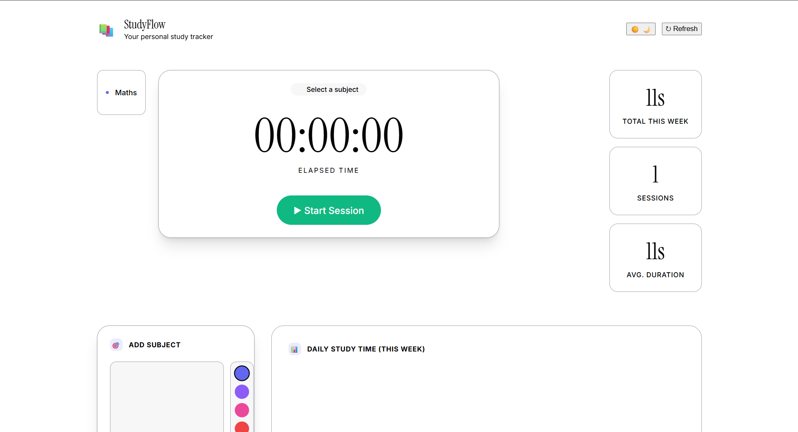

<div align="center">

# 📚 StudyFlow — Study Session Tracker

**A sleek, dark-mode study tracker built with Flask and vanilla JS.**  
Log sessions, time yourself, visualise your week, and share your wins on X (Twitter).

[](https://python.org)
[](https://flask.palletsprojects.com)
[](https://sqlite.org)
[](LICENSE)

</div>

---

## ✨ Features

| Feature | Details |
|---|---|
| 🎯 **Subject Management** | Add unlimited subjects with custom colour labels; delete anytime |
| ⏱️ **Live Timer** | Start / stop a session with a real-time `HH:MM:SS` display and an optional notes field |
| 💾 **Local Storage** | All data persisted in a local SQLite database — no account, no cloud required |
| 📊 **Weekly Dashboard** | 7-day bar chart, per-subject breakdown bars, and summary stat cards |
| 🔄 **Refresh Button** | One-click animated spinner to reload all data from the backend |
| 🐦 **Tweet / X Sharing** | Select any session and post a pre-formatted study summary to X (Twitter) |
| 🌑 **Dark Mode** | Deep `#0a0a0f` background with indigo/purple glow, glassmorphism cards, Inter font |

---

## 📸 Screenshots

> **Full app overview — timer, weekly stats, session history & subject sidebar**



---

## 🛠️ Tech Stack

| Layer | Technology |
|---|---|
| **Backend** | Python · Flask 3.x |
| **Database** | SQLite 3 (Python `sqlite3` stdlib — no ORM) |
| **Frontend** | Vanilla HTML5 · CSS3 · JavaScript (ES2020+) |
| **Typography** | [Inter](https://fonts.google.com/specimen/Inter) via Google Fonts |
| **Sharing** | Twitter / X Web Intent API |
| **Dev Server** | Flask built-in development server |

---

## ⚙️ Installation

### Prerequisites

- Python **3.10** or newer
- `pip` (bundled with Python)
- Git

### Steps

```bash
# 1. Clone the repository
git clone https://github.com/Anushiv7/StudyFlow-StudyTracker.git
cd StudyFlow-StudyTracker

# 2. (Recommended) Create and activate a virtual environment
python -m venv .venv

# Windows
.venv\Scripts\activate

# macOS / Linux
source .venv/bin/activate

# 3. Install dependencies
pip install -r requirements.txt

# 4. Run the app
python app.py
```

Open your browser at **[http://127.0.0.1:5000](http://127.0.0.1:5000)**

> The SQLite database (`study_tracker.db`) is created automatically on first run — no manual setup needed.

---

## 🚀 Usage

### 1 · Add a Subject
- Type a subject name in the **Add Subject** card (e.g. *Mathematics*)
- Pick a colour with the colour picker
- Click **+ Add Subject** or press `Enter`

### 2 · Start a Study Session
- Click a subject from the **Subjects** list to select it (highlights with an indigo border)
- Press **▶ Start Session** — the live `HH:MM:SS` timer begins
- Optionally type session notes in the text area below the timer

### 3 · Stop & Save
- Press **■ Stop Session** — the session is saved to the local database instantly
- A toast notification confirms the saved duration

### 4 · View Weekly Progress
- **Daily Study Time** bar chart shows the past 7 days (hover a bar for the exact duration)
- **Subject Breakdown** displays proportional time spent per subject
- Stat cards show your **total time**, **session count**, and **average duration** for the week

### 5 · Share on X (Twitter)
Two ways to post a session:

| Method | How |
|---|---|
| **Quick tweet** | Click the **Tweet** button on any row in the session history list |
| **Select & tweet** | Click a session row to select it → blue action bar appears → click **Post to X** |

The tweet is auto-filled with subject name, duration, date, notes, and `#StudySession #Learning #Productivity`.

### 6 · Refresh Data
Click **↻ Refresh** in the header — a spinner plays while all data reloads from the backend.

---

## 📁 Project Structure

```
StudyFlow-StudyTracker/
├── app.py                  # Flask app & REST API (8 endpoints)
├── requirements.txt        # Python dependencies (Flask)
├── .gitignore
├── README.md
├── docs/
│   └── screenshots/
│       └── app-preview.jpg
├── templates/
│   └── index.html          # Main Jinja2 template
└── static/
    ├── css/
    │   └── style.css       # Dark mode design system
    └── js/
        └── app.js          # Timer, chart rendering & tweet logic
```

> `study_tracker.db` is generated at runtime and excluded via `.gitignore`.

---

## 🔌 API Reference

| Method | Endpoint | Description |
|---|---|---|
| `GET` | `/api/subjects` | List all subjects |
| `POST` | `/api/subjects` | Create a subject `{ name, color }` |
| `DELETE` | `/api/subjects/<id>` | Delete a subject (cascades sessions) |
| `POST` | `/api/sessions/start` | Start a session `{ subject_id }` |
| `POST` | `/api/sessions/<id>/stop` | Stop & save a session `{ notes }` |
| `GET` | `/api/sessions?days=7` | List completed sessions |
| `DELETE` | `/api/sessions/<id>` | Delete a session |
| `GET` | `/api/stats/weekly` | Weekly stats by subject & by day |

---

## 📄 License

This project is licensed under the **MIT License**.

---

<div align="center">

Made with ❤️ by [Anushiv7](https://github.com/Anushiv7)

</div>
"YOLO badge attempt" 
